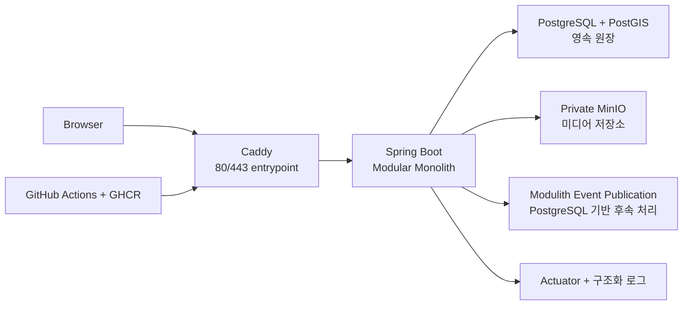

# TownPet Spring Boot

반려생활 커뮤니티 플랫폼 TownPet을 Java·Spring Boot 기반의 모듈형 모놀리스로 재아키텍처한 프로젝트입니다.

기존 서비스의 화면·URL·주요 사용자 흐름은 유지하면서, 인증·권한·데이터 정합성·조회 성능·이벤트 후속 처리·백업과 복구를 Spring Boot와 PostgreSQL 중심으로 다시 설계했습니다. 단순 CRUD 구현보다 **제품 동등성과 운영 가능한 서버를 만드는 과정**에 초점을 둔 개인 프로젝트입니다.

> 공개 데모는 합성 계정·합성 콘텐츠만 사용하는 포트폴리오 sandbox입니다. 실제 개인정보를 수집하거나 포함하지 않습니다.

[🚀 Live Demo — townpet.cloud](https://townpet.cloud/) · [기술 문서](docs/문서-안내.md) · [개발 기록](docs/08-면접-복기/개발-연대기.md)

## 한눈에 보기

| 항목 | 내용 |
| --- | --- |
| 프로젝트 | 반려동물 지역 커뮤니티·정보 공유 플랫폼 |
| 역할 | 설계, 백엔드·프론트엔드 개발, 테스트, 성능 측정, 배포·복구 검증 |
| 실제 배포 | [https://townpet.cloud/](https://townpet.cloud/) |
| 핵심 전환 | Next.js/Prisma 서버 → Spring Boot modular monolith/PostgreSQL |
| 제품 범위 | 공개 피드, 검색, 게시글, 댓글, 반응, 북마크, 알림, 신고, 분실·목격, 입양·봉사·돌봄·모임, 미디어 |
| 규모 기준선 | 기존 49개 page, 55개 API route의 주요 사용자 여정과 동작을 기준으로 재작성 |
| 운영 형태 | React/Vite 정적 asset + Spring Boot + PostgreSQL/PostGIS + private MinIO + Caddy |
| 배포 | Docker Compose, GitHub Actions, GHCR, Cloudflare DNS, netcup VPS |

## 핵심 결과

### 공개 피드 조회 성능

100,000건의 동일한 합성 fixture에서 실행 계획과 HTTP 부하를 비교했습니다.

| 지표 | 인덱스 적용 전 | 인덱스 적용 후 |
| --- | ---: | ---: |
| p95 | 67.13ms | **5.01ms** |
| 처리량 | 19.40 req/s | **420.78 req/s** |
| DB 실행 계획 | Parallel Seq Scan + top-N sort | **복합 인덱스 Index Scan** |
| HTTP 실패 | 0 | **0** |

`(lifecycle, scope, created_at DESC, id DESC)` 복합 인덱스를 적용하고, `EXPLAIN (ANALYZE, BUFFERS)`로 21개 row를 적은 buffer hit로 읽는 경로를 확인했습니다. 이 결과는 로컬 1 VU 비교 실험이며 운영 SLA나 VPS 처리량으로 과장하지 않았습니다. [측정 상세](docs/06-성능/결과/2026-08-12-공개-피드-인덱스.md)

### 신뢰성 경계

- **권한 우회 방지:** 인증된 세션 주체와 resource ownership을 함께 검사하고, Staff 기능은 deny-by-default RBAC로 제한했습니다.
- **브라우저 인증:** Browser JWT 대신 Spring Security·Spring Session JDBC·HttpOnly session cookie·CSRF를 사용했습니다.
- **조회수 정합성:** `find → save` 방식의 lost update를 `ON CONFLICT DO UPDATE ... RETURNING` atomic upsert로 교체했습니다.
- **정원·첨부 개수 경합:** 공유 불변식이 있는 변경에 row lock과 database constraint를 적용했습니다.
- **알림 후속 처리:** 핵심 transaction과 부수효과를 분리하고 Spring Modulith Event Publication Registry와 PostgreSQL로 재시도 가능한 publication을 관리했습니다. consumer는 중복 실행에 안전하게 구성했습니다.
- **민감 정보 보호:** 분실·목격의 정확 위치와 private media는 공개 응답·검색·로그에서 분리했습니다.

## 아키텍처



하나의 Spring Boot 배포 단위 안에서 도메인별 공개 API와 내부 구현을 분리했습니다. 모듈 간에는 JPA entity·repository를 직접 노출하지 않고 식별자, 공개 application API와 event로 연결합니다. Spring Modulith와 ArchUnit 테스트가 순환 의존과 내부 타입 노출을 검증합니다.

주요 모듈은 `identity`, `member`, `publication`, `engagement`, `discovery`, `notification`, `lostfound`, `marketplace`, `care`, `gathering`, `media`, `trustsafety`, `operations`입니다. [모듈 지도](docs/02-설계/모듈-지도.md)

## 기술 스택

- **Backend:** Java 25, Spring Boot 4.1, Spring Security, Spring Session JDBC, Spring Modulith, Gradle
- **Persistence:** PostgreSQL 18, PostGIS 3.6, Spring Data JPA/Hibernate, jOOQ, Flyway
- **Frontend:** React 19, TypeScript, Vite, React Router
- **Storage:** private MinIO, presigned URL, PostgreSQL media metadata
- **Testing:** JUnit, Spring Boot Test, Testcontainers, ArchUnit, Vitest, Playwright, k6
- **Delivery:** Docker Compose, Caddy, GitHub Actions, GHCR, Cloudflare DNS, age encrypted backup

Redis, Kafka, Elasticsearch와 Kubernetes는 기술 이름을 늘리기 위해 추가하지 않았습니다. 실행 계획, DB 경합, 이벤트 적체를 먼저 측정하고 현재 단일 PostgreSQL 원장과 모듈형 모놀리스가 요구사항을 충족하는 범위에서는 운영 복잡도를 늘리지 않았습니다. [선택 근거](ADR.md)

## 구현에서 다룬 문제

### Legacy 동작을 유지하면서 서버를 교체

이번 작업은 새 UI를 만드는 프로젝트가 아니라, 기존 TownPet의 관찰 가능한 동작을 기준으로 서버 아키텍처를 교체하는 작업입니다. 화면·URL·입력 규칙·권한·상태 전이·오류 응답을 parity 기준으로 확인하고, 내부 구현은 Spring 방식으로 재설계했습니다.

### Cursor 기반 피드

offset pagination은 앞 페이지에 새 글이 삽입될 때 중복·누락이 생길 수 있습니다. `(created_at, id)`를 안정적인 정렬 기준으로 삼아 cursor를 API·DB·프론트엔드에 일관되게 적용하고, 피드 조회에는 조건에 맞는 복합 인덱스를 사용했습니다.

### 모듈 경계와 데이터 소유권

공통 `Publication`과 분실·장터·돌봄 같은 구조화 aggregate를 분리했습니다. 각 module이 자신의 상태와 불변식을 소유하도록 하여, 하나의 거대한 entity graph와 module 간 JPA association에 의존하지 않도록 했습니다.

### 안전한 공개 데모와 운영

공개 환경에는 versioned synthetic fixture만 주입합니다. 배포는 이미지를 GHCR에서 pull하는 방식으로 구성하고, PostgreSQL·MinIO paired backup, age 암호화, disposable restore와 이미지 rollback rehearsal을 운영 절차에 포함했습니다. [운영 검증 기록](docs/09-운영-가이드/운영-검증-기록-2026-08-17.md)

## 검증

기능 경계와 구조를 다음 방식으로 확인합니다.

- Spring Modulith module dependency·ArchUnit layer rule
- PostgreSQL Testcontainers 기반 통합 테스트와 Flyway migration test
- 권한 우회, 다른 사용자 resource 접근, 신고·moderation 경계 테스트
- 조회수 동시 요청 160건을 8개 thread로 실행한 counter 대사
- 모집 정원 경합과 media 첨부 개수 제한 동시성 테스트
- React unit test, TypeScript typecheck, Vite build, Playwright 사용자 흐름
- k6 기반 public feed·member read·mixed workload smoke
- 백업 복호화, disposable restore, 컨테이너 health check, 이미지 rollback rehearsal

로컬에서 주요 검증을 실행하려면 다음 명령을 사용합니다.

```bash
# Backend
./gradlew clean check migrationTest

# Frontend
cd frontend
corepack pnpm install --frozen-lockfile
corepack pnpm typecheck
corepack pnpm test
corepack pnpm build
corepack pnpm test:e2e
```

Docker daemon과 필요한 환경 변수가 있는 경우 전체 frontend-backend smoke는 아래 스크립트로 실행할 수 있습니다.

```bash
./scripts/frontend-backend-smoke.sh
```

## 저장소 둘러보기

```text
src/main/java/com/townpet/   Spring Boot business modules
src/main/resources/db/       Flyway migrations
frontend/                    React/Vite application
src/test/                    unit, integration, architecture tests
loadtest/                    k6 workload definitions
deploy/                      Compose, backup, restore, rollback scripts
docs/02-설계/                module map and design decisions
docs/06-성능/                reproducible performance evidence
docs/08-면접-복기/            development chronology and technical notes
docs/09-운영-가이드/          deployment and recovery runbooks
```

## 이 프로젝트에서 확인할 수 있는 것

- 요구사항을 화면 목록이 아니라 **데이터 모델·권한 정책·상태 전이·검증 기준**으로 구체화한 과정
- 성능 문제를 추측하지 않고 **실행 계획과 동일 fixture 기반 수치**로 판단한 과정
- 단일 배포 단위의 단순성을 유지하면서도 **모듈 경계·트랜잭션·이벤트·복구 경계**를 명시한 설계
- 정상 흐름뿐 아니라 권한 우회, lost update, 정원 초과, 이벤트 재처리, 백업 복구 같은 실패 조건을 재현한 검증
- 공개 배포에서 실제 개인정보와 운영 credential을 분리하고, 합성 demo와 복구 절차를 포함한 운영 방식

자세한 설계 의사결정은 [ADR.md](ADR.md), 제품 범위는 [제품 요구사항](docs/01-기준/제품-요구사항.md), 기술 제약은 [기술 요구사항](docs/01-기준/기술-요구사항.md)에서 확인할 수 있습니다.

## 현재 상태와 한계

TownPet은 공개 HTTPS smoke, 애플리케이션·DB·MinIO health check, 백업·복구와 이미지 rollback rehearsal까지 검증된 portfolio sandbox입니다. 다만 현재 운영 기록 기준으로 netcup outbound SMTP 포트의 외부 연결과 실제 메일함 도착은 아직 완료 증거가 없습니다. 따라서 인증·복구 메일의 SMTP 전달을 완전히 검증했다고 주장하지 않습니다. [남은 운영 검증](PLAN.md)

또한 단일 VPS 구성은 비용과 운영 학습에는 적합하지만, 애플리케이션과 데이터베이스가 같은 failure domain에 있어 고가용성을 제공하지 않습니다. 외부 암호화 백업과 restore 절차로 복구 가능성을 높였지만, 다중 리전·무중단 failover를 해결한 시스템으로 표현하지 않습니다.
