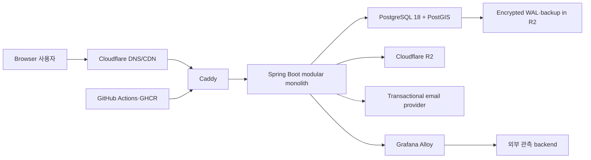
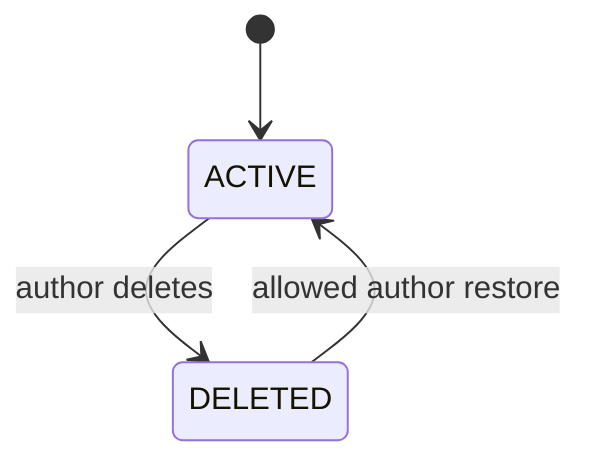
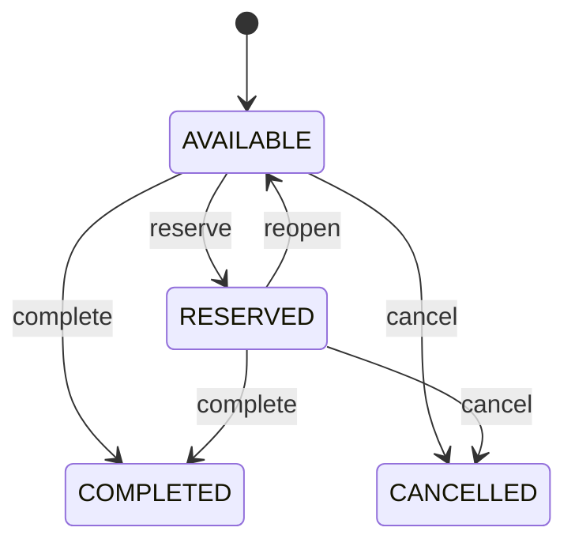
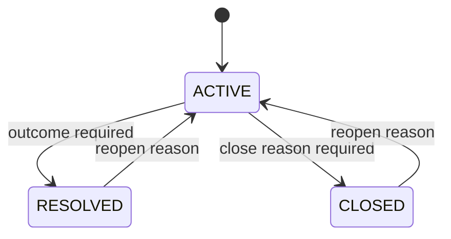
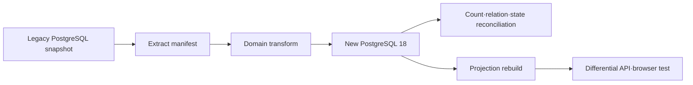

# TownPet Springboot 기술 요구사항·설계

## 1. 문서 목적과 상태

이 문서는 [`PRD.md`](./PRD.md)의 제품 요구사항을 구현하기 위한 목표 architecture, 계약, 제약, 운영과 검증 방식을 정의한다. 아직 application scaffold가 없는 설계 기준 문서이며 현재 구현과 혼동하지 않는다. 확정된 선택과 대안은 [`../ADR.md`](../ADR.md), 현재 실행 작업은 [`../PLAN.md`](../PLAN.md)를 따른다.

## 2. 현재와 목표의 분리

### 2.1 Legacy 기준선

- 저장소: `/Users/alex/project/townpet`
- commit: `7d8f6d0bd22dedd82350c05142823ab2d101574d`
- runtime: Next.js 16 App Router, React 19, TypeScript, NextAuth, Prisma, PostgreSQL, Vercel
- 제품 표면: 49 pages, 55 API routes, 비테스트 TSX UI source 181개(이 중 `app/src/components` 113개)
- 역할: 요구사항, migration input, differential·visual baseline
- 금지: Legacy server code를 줄 단위로 번역하거나 production runtime dependency로 영구 유지

### 2.2 목표 시스템

- Java 25 LTS, Spring Boot 4.1, Spring Framework 7, Spring Modulith 2.1
- Gradle 9 Wrapper + Kotlin DSL, application code는 Java
- React 19 + TypeScript + Vite, React Router
- PostgreSQL 18 + PostGIS 3.6
- Spring Data JPA/Hibernate write model + jOOQ read model
- Flyway schema authority, controller/request DTO HTTP contract
- 하나의 Spring Boot deployable과 하나의 PostgreSQL cluster
- Hetzner CX23 showcase production, Caddy, Cloudflare R2, Grafana Alloy
- Node.js는 frontend 개발·빌드에만 사용하고 production server에는 존재하지 않음

## 3. System Context



Trust boundary는 Browser, public reverse proxy, application, database·object storage, 외부 email, staff operations로 구분한다. Browser 입력과 외부 email provider 응답은 모두 신뢰하지 않으며 application module API와 database constraint를 함께 통과해야 한다.

## 4. Repository 목표 구조

```text
townpet-springboot/
├── AGENTS.md
├── ADR.md
├── GLOSSARY.md
├── PLAN.md
├── README.md
├── settings.gradle.kts
├── build.gradle.kts
├── gradle/
├── api/
├── frontend/
│   ├── package.json
│   ├── vite.config.ts
│   ├── src/
│   └── e2e/
├── src/
│   ├── main/java/com/townpet/
│   ├── main/resources/db/migration/
│   └── test/java/com/townpet/
├── migration/
│   ├── src/main/java/com/townpet/migration/
│   └── fixtures/
├── deploy/
│   ├── terraform/
│   ├── ansible/
│   ├── caddy/
│   └── compose/
├── docs/
│   ├── PRD.md
│   ├── TRD.md
│   ├── parity/
│   ├── performance/
│   └── runbooks/
└── .github/workflows/
```

초기에는 Gradle application module 하나를 사용한다. 물리적 multi-project build보다 Java package와 Spring Modulith verification으로 business module을 분리한다. Migration CLI는 같은 repository의 별도 source set 또는 명시적 application entrypoint로 실행하며 web request path와 섞지 않는다.

## 5. Application Module Map

`com.townpet` 바로 아래 package가 기본 Spring Modulith module이다. 다른 module이 사용할 수 있는 type은 module root의 공개 package 또는 `api` named interface에만 둔다. `internal`, JPA entity, repository, controller DTO와 generated persistence type은 외부에서 참조할 수 없다.

| Module | 책임 | 소유 데이터 | 대표 동기 의존 |
|---|---|---|---|
| `identity` | credential, session, email verification·account recovery, staff identity | credential, session, verification_token, password_reset_token | member |
| `member` | 회원 profile, onboarding, neighborhood, preference | member, member_profile, member_neighborhood | catalog |
| `catalog` | neighborhood, community, breed, pet type 기준 정보 | neighborhood, community, breed, pet_type | 없음 |
| `publication` | 공통 게시 내용, scope, author, lifecycle, effective visibility | publication, publication_image_ref, visibility_restriction | identity, member, catalog |
| `engagement` | comment, reaction, bookmark, view와 summary | comment, reaction, bookmark, engagement_summary, view_bucket | publication, relationship |
| `localguide` | 병원·장소 후기와 산책 구조화 정보 | hospital_review, place_review, walk_route | publication, catalog |
| `marketplace` | 판매·대여·나눔 조건과 listing lifecycle | market_listing, market_status_event | publication |
| `care` | 돌봄 request, application, assignment, feedback | care_request, care_application, care_assignment, care_feedback | publication, relationship |
| `welfare` | 입양·보호소 봉사 구조화 정보 | adoption_listing, volunteer_recruitment | publication, catalog |
| `lostfound` | alert, sighting, location evidence, status history | lost_found_alert, sighting_report, exact_location_evidence | publication, media |
| `gathering` | meetup와 참가 정원·상태 | meetup, meetup_participation | publication, relationship |
| `relationship` | follow, block와 interaction relation | member_follow, member_block | member |
| `trustsafety` | report, sanction, policy, moderation audit | report, sanction, abuse_signal, moderation_action | identity, publication, engagement |
| `discovery` | SearchDocument, FeedDocument, ranking·suggestion | search_document, feed_document, search_metric | publication, engagement, relationship |
| `notification` | in-app notification, delivery, unread state | notification, notification_delivery | identity, member |
| `media` | upload lifecycle, object metadata, derivative | upload_asset, media_derivative | identity |
| `operations` | repair, rebuild, demo reset, deployment·backup evidence | operation_run, repair_audit, demo_seed_state | 공개 module API들 |

`common`은 UUID, clock, error, telemetry, transaction helper 같은 기술 요소만 가진다. `User`, `Post`, `Status` 같은 business supertype이나 모든 module이 쓰는 repository를 두지 않는다.

## 6. Module 내부 구조

```text
com.townpet.marketplace/
├── package-info.java
├── api/                 # 다른 module용 command/query facade와 event type
├── application/         # use case, transaction, authorization policy
├── domain/              # aggregate, value object, domain service, port
├── infrastructure/      # JPA entity, repository adapter, jOOQ query
└── web/                 # generated transport interface 구현과 mapper
```

- Web controller는 authentication, transport validation, use case 호출과 response mapping만 수행한다.
- Application service가 transaction과 resource authorization 경계다.
- Domain object는 Spring MVC, JPA annotation과 transport DTO를 알지 않는다. Persistence annotation은 infrastructure entity에 둔다.
- Module 간 동기 호출은 공개 facade만 사용한다.
- Commit 이후 side effect는 immutable module event를 우선한다.
- Eventual consistency로 허용할 수 없는 invariant는 source module의 한 transaction에서 처리한다.

## 7. Frontend Architecture

- `frontend/`는 React 19, TypeScript, Vite와 React Router를 사용한다.
- `/Users/alex/project/townpet/app/src/components`, style과 static asset을 선별 이전한다.
- Next.js page, Server Component, Server Action, Route Handler, NextAuth·Prisma import는 이전하지 않는다.
- Data access는 `frontend/src/api/client.ts`의 얇은 fetch 경계로 통일한다.
- Server state는 endpoint 특성에 맞는 작은 query abstraction으로 관리하며 Redux를 기본 도입하지 않는다.
- Vite dev server는 `/api/**`를 local Spring Boot로 proxy한다.
- Production build asset은 Gradle processResources 전에 생성되고 Spring Boot artifact에 포함된다.
- Spring MVC가 기존 direct URL에 page별 title·description·Open Graph를 포함한 HTML shell을 반환한다.
- Asset filename은 content hash를 사용하고 immutable cache, HTML shell은 짧은 cache 정책을 사용한다.
- `frontend` build 결과를 source control에 commit하지 않는다.

## 8. API Contract

### 8.1 Source of Truth

- Spring controller와 request/response DTO가 HTTP contract의 source다. public API prefix는 `/api/v1`이다.
- Java transport interface·DTO와 TypeScript client를 같은 contract에서 생성한다.
- Domain, JPA entity와 repository는 생성하지 않는다.
- Generated source를 직접 편집하지 않는다.

### 8.2 Conventions

- ID: canonical lowercase UUID string
- Timestamp: UTC RFC 3339 string
- Date-only: ISO local date
- KRW: 원 단위 JSON integer, floating point 금지
- Pagination: opaque stable cursor, offset은 작은 admin export 외 기본 금지
- Errors: RFC 9457 `ProblemDetail` + stable `code`, `fieldErrors`, `traceId`
- Mutation: action endpoint와 의도 기반 command 사용
- Retry-sensitive mutation: `Idempotency-Key`와 저장된 result 사용
- Concurrent mutation: aggregate version 또는 `If-Match`, stale request는 `409`
- Unknown enum: server는 명시적으로 거부하고 client fallback label은 display에만 사용

### 8.3 Representative Routes

```text
POST   /api/v1/auth/sessions
DELETE /api/v1/auth/sessions/current
GET    /api/v1/feed
POST   /api/v1/publications
GET    /api/v1/publications/{publicationId}
POST   /api/v1/publications/{publicationId}/comments
PUT    /api/v1/publications/{publicationId}/reaction
POST   /api/v1/market-listings/{listingId}:reserve
POST   /api/v1/market-listings/{listingId}:complete
POST   /api/v1/lost-found-alerts/{alertId}/sightings
POST   /api/v1/lost-found-alerts/{alertId}:resolve
POST   /api/v1/reports
POST   /api/v1/operations/projections/{projection}:rebuild
```

실제 route 이름은 parity inventory와 controller review에서 확정하되 generic `PATCH status`보다 business action을 우선한다.

### 8.4 Compatibility

- Legacy의 관찰 가능한 의미를 v1 contract에 매핑한다.
- Domain 용어와 legacy wire 값이 다르면 anti-corruption mapper를 둔다. 예: legacy market `SOLD`와 domain `COMPLETED`.
- 승인된 breaking change는 새 API version 또는 명시적 migration window가 필요하다.

## 9. Identity·Session·Authorization

### 9.1 Browser Session

- Spring Security와 Spring Session JDBC를 사용한다.
- Cookie는 opaque session ID, `HttpOnly`, `Secure`, 적절한 `SameSite`와 제한 path를 사용한다.
- Login 성공 시 session fixation protection을 수행한다.
- CSRF token은 React client와 명시적으로 교환하고 모든 state-changing browser request에 검증한다.
- Session은 PostgreSQL 원장에 저장하고 비밀번호 변경·재설정·sanction 시 관련 session을 즉시 revoke한다.
- Browser JWT를 발급하지 않는다.

### 9.2 Credentials·Account Recovery

- Password는 Spring Security의 검증된 adaptive password encoder와 versioned parameter를 사용한다.
- 이메일 인증과 비밀번호 재설정 token은 raw 값을 한 번만 전달하고 hash·만료·사용 상태만 저장한다.
- 요청 응답으로 계정 존재 여부나 이메일 인증 상태를 노출하지 않는다.
- Password reset 성공 시 해당 회원의 기존 session을 폐기한다.
- Showcase profile에서는 public signup을 끄고 고정 Credentials demo 계정만 제공한다.
- Kakao·Naver 인증과 social account link·unlink는 구현하지 않는다. 필요가 확인되면 provider 계약, 계정 충돌 정책과 보안 검증을 별도 ADR로 설계한다.

### 9.3 Guest

- GuestPrincipal은 random identifier와 server state로 연속성을 제공한다.
- 콘텐츠 관리 비밀번호는 콘텐츠 범위의 adaptive hash만 저장한다.
- IP·fingerprint는 rotating secret HMAC으로 abuse detection에만 사용한다.
- 위험 작업은 one-time, scoped, expiring step-up challenge를 요구한다.

### 9.4 Authorization

- 모든 use case는 deny by default다.
- Controller annotation은 authentication·coarse role만 확인한다.
- Module application policy가 ownership, lifecycle, block, restriction와 staff scope를 평가한다.
- Private resource 존재를 알 권한이 없으면 `404`, 공개 resource action만 금지되면 `403`을 사용한다.
- MODERATOR, OPERATOR, ADMIN 책임을 분리하고 superuser bypass를 request path에 두지 않는다.
- Staff action은 assurance, reason과 append-only decision audit를 남긴다.

## 10. Data·Persistence

### 10.1 Schema Authority

- Flyway versioned migration만 table, constraint, index, extension, trigger와 view를 변경한다.
- Hibernate `ddl-auto=validate`를 local·test·production 모두 사용한다.
- H2를 production-equivalent test로 사용하지 않는다.
- Migration은 expand/contract와 forward-fix를 기본으로 한다.

### 10.2 Write와 Read

- JPA/Hibernate: aggregate write, optimistic version, lifecycle persistence
- jOOQ: feed, search, list, admin projection, spatial query와 reporting
- OSIV 비활성화
- JPA entity와 repository는 module infrastructure 내부
- Module·aggregate 간 JPA association 금지, typed UUID reference 사용
- jOOQ write는 승인된 repair·backfill use case 외 금지

### 10.3 Data Conventions

- PostgreSQL 18 최신 검증 minor와 PostGIS 3.6 사용
- Domain ID는 native UUIDv7, API는 canonical string
- 절대 시간은 `timestamptz` + Java `Instant`, runtime은 UTC
- 시간대 없는 달력 값은 `date` + `LocalDate`
- 금액은 `bigint` 원 단위 + Java value object
- 상태는 `varchar` + check 또는 owner table, PostgreSQL enum 기본 금지
- `jsonb`는 실제 가변 metadata·audit snapshot에만 사용
- 핵심 검색·join·constraint field를 JSON에 숨기지 않음
- Business lifecycle 대신 획일적 `deleted_at`을 사용하지 않음

### 10.4 Concurrency

- 기본 isolation은 `READ COMMITTED`
- Aggregate root는 optimistic version 사용
- Unique·partial unique·check·foreign key와 conditional update로 invariant 보호
- Pessimistic lock은 짧은 scarce-resource transaction에만 사용
- 복수 lock은 stable UUID order로 획득
- Deadlock·serialization retry는 idempotent command에 한해 bounded exponential backoff+jitter 적용
- Query-count test로 N+1을 실패 처리

## 11. 핵심 Domain Model

### 11.1 Publication과 Restriction



Publication lifecycle과 `VisibilityRestriction`은 별도 record다. Effective visibility는 publication state, 모든 active restriction, viewer relationship과 role을 조합한다. TrustSafety는 Publication 공개 API를 호출하고 source table을 직접 변경하지 않는다.

### 11.2 Marketplace



- `ListingTerms` sealed hierarchy: `SaleTerms`, `RentalTerms`, `ShareTerms`
- Sale price 1원–1억 원, Rental fee 0원–1억 원·기간 필수, Share price 0원
- Reserved 이후 terms 수정 금지
- Platform payment·order·chat 없음
- 금지 품목은 hard rule, 불확실 위험은 soft signal

### 11.3 Care

- `CareRequest`: OPEN, MATCHED, CANCELLED, EXPIRED
- `CareApplication`: PENDING, ACCEPTED, DECLINED, WITHDRAWN
- `CareAssignment`: MATCHED, IN_PROGRESS, COMPLETED, CANCELLED_BY_REQUESTER, CANCELLED_BY_CAREGIVER, ABORTED
- Request당 active assignment partial unique index
- 수락 transaction이 request 조건부 update, application 결정, assignment 생성과 나머지 decline을 원자적으로 처리
- 세부 제품 확장은 하지 않고 legacy parity를 우선

### 11.4 LostFound



- `LostFoundAlert`: 사건과 lifecycle
- `SightingReport`: Comment와 분리된 구조화 제보
- Public approximate geography는 250m precision, exact location은 application-level encryption
- Spatial query는 public point의 GiST + `ST_DWithin`
- RESOLVED·CLOSED는 active projection과 신규 sighting에서 제외
- 상태 history는 reason·outcome·actor·version을 append-only로 기록

## 12. Durable Event·Projection

### 12.1 Event Publication

- Spring Modulith JDBC Event Publication Registry를 PostgreSQL에 둔다.
- Source aggregate 변경과 event publication row를 같은 transaction에 기록한다.
- Delivery는 at-least-once이며 listener는 event ID 또는 business idempotency key로 중복 처리에 안전해야 한다.
- Listener 실패, retry count, oldest age와 payload type을 운영 화면·metric에 노출한다.
- Operator는 실패 event를 원인 해결 후 재제출할 수 있다.
- Kafka는 초기 범위가 아니다.

### 12.2 Search

- PostgreSQL `SearchDocument`가 publication·구조화 field의 searchable projection을 소유한다.
- `tsvector`, GIN, `pg_trgm`과 명시적 normalization을 사용한다.
- Search event listener는 idempotent upsert·remove를 수행한다.
- 전체 rebuild, shadow index와 corpus regression을 제공한다.

### 12.3 Feed

- `FeedDocument`는 publication·engagement·visibility candidate field를 저장한다.
- Candidate SQL과 versioned ranking function을 분리한다.
- Cursor에는 ranking version과 stable tie-breaker를 포함한다.
- Per-user full feed materialization은 하지 않는다.
- Hidden·deleted·blocked data는 stale projection이어도 final visibility gate에서 fail closed한다.

### 12.4 Engagement Summary

- Comment, Reaction, Bookmark가 원장이다.
- `EngagementSummary`는 source transaction에서 atomic delta로 변경한다.
- View는 viewer HMAC + time bucket source를 지연 집계한다.
- Reconciliation job이 source와 summary drift를 탐지·repair한다.

## 13. Media

- PostgreSQL `UploadAsset`가 upload 상태, owner, object key, checksum, MIME, byte·pixel, expiration을 소유한다.
- Local은 MinIO, showcase는 Cloudflare R2를 사용한다.
- Client는 server가 발급한 presigned upload로 object storage에 직접 전송한다.
- Finalize command가 object metadata·magic byte·quota·owner를 확인한 뒤 READY로 전환한다.
- Publication은 READY asset만 연결할 수 있다.
- Thumbnail·derivative는 durable event로 생성하고 실패를 재시도한다.
- Private sighting media는 public bucket·CDN URL을 사용하지 않고 짧은 권한 URL로 전달한다.
- Legacy Vercel Blob object는 manifest, checksum과 source URL mapping으로 이전한다.

## 14. Migration·Parity

### 14.1 ETL



- Raw production dump, personal data와 secret은 Git에 저장하지 않는다.
- ETL은 source ID mapping과 checkpoint를 가져야 하고 재실행에 안전해야 한다.
- Token, session, reset·verification nonce는 이전하지 않는다.
- Table·state count, referential integrity, orphan, summary와 deterministic sample을 대사한다.
- 의미 불명확 row는 quarantine하고 자동 추정하지 않는다.
- Cutover 전에 snapshot dry-run, elapsed time, rollback point와 recovery rehearsal을 수행한다.

### 14.2 Parity Matrix

각 행은 legacy URL/API, actor, fixture, input, expected response·screen, permission, state, responsive, accessibility, SEO, migration mapping, test와 status를 가진다.

Domain 완료는 다음을 모두 요구한다.

1. Schema·ETL·reconciliation
2. HTTP controller·Spring use case·persistence
3. React UI integration
4. Differential·visual·accessibility test
5. Legacy adapter·Prisma·Next route 제거
6. Metric·runbook·repair path

## 15. Observability·SLO

### 15.1 Telemetry

- Micrometer + OpenTelemetry로 vendor-neutral 계측
- JSON stdout log와 trace·span·request ID
- Cookie, token, credential, PII와 exact location redaction
- Low-cardinality metric label만 허용
- Grafana Alloy가 application, PostgreSQL, node, container metric·log·trace를 외부 backend로 전송
- VPS에는 크기 제한된 local log만 유지하고 Prometheus·Grafana·Loki·Tempo를 모두 자체 호스팅하지 않음

### 15.2 Minimum Dashboards

- HTTP success·latency와 route group
- JVM heap·GC·thread·startup
- Hikari pool, PostgreSQL lock·slow query·WAL·vacuum
- Node CPU·memory·disk·restart·certificate
- Event backlog·oldest age·failure
- Search·Feed freshness와 rebuild
- Backup age·WAL archive lag·restore drill
- Authentication failure·rate limit·staff action
- Deployment version·image digest와 SLO burn

### 15.3 SLO

- 30일 rolling public journey availability 99.5%
- Core server-side success 99.5%
- Controlled read p95 300ms, write p95 500ms
- Korean mobile p75 LCP 2.5s, INP 200ms, CLS 0.1
- Projection p95 30초, oldest backlog 60초
- WAL lag 5분, verified backup age 24시간
- Failure detection 5분
- 30일 budget 50% 소진 시 고위험 release 제한, 100% 소진 시 안정화 우선

## 16. Deployment·Recovery

### 16.1 Topology

- Hetzner EU CX23: 2 shared vCPU, 4GB RAM, 40GB SSD
- Containers: Caddy, Spring Boot, PostgreSQL/PostGIS, Grafana Alloy, maintenance
- Build는 GitHub Actions에서 수행하고 GHCR immutable digest만 pull
- PostgreSQL, privileged Actuator와 admin surface는 public port에 노출하지 않음
- SSH key, non-root deploy account, host firewall와 automatic security update 사용
- Deploy 동안만 old·new Spring container를 함께 실행

### 16.2 Deployment Flow

1. CI가 test·scan·SBOM·provenance를 완료한다.
2. Compatible Flyway expand migration을 one-off job으로 실행한다.
3. New image digest로 후보 container를 시작한다.
4. Readiness, API, DB, event backlog와 browser smoke를 실행한다.
5. Caddy upstream을 후보로 전환한다.
6. 5xx, latency, burn와 restart를 관찰한다.
7. 실패하면 이전 image와 호환 schema로 되돌린다.

### 16.3 Backup·Restore

- RPO 5분, 장애 인지 후 RTO 60분
- WAL 최대 5분 내 encrypted R2 archive
- 일일 logical backup, 주기적 physical base backup
- Retention: WAL 7일, daily 14일, weekly 8주, monthly 6개월
- Weekly disposable restore + Flyway·query validation
- Monthly application smoke·reconciliation
- Quarterly clean VPS full recovery drill
- Backup manifest: cluster, PostgreSQL·schema version, time, checksum, size, WAL range
- Encryption key는 storage, image와 Git에서 분리

## 17. Showcase Production

- Public signup disabled; Kakao·Naver auth is outside the current product scope
- 고정 MEMBER demo 계정 3개 이상과 제한된 MODERATOR 계정
- 일반 credentials API·Spring Session을 그대로 사용
- Demo identity·password·role 변경 금지
- ADMIN·OPERATOR 공개 금지
- Versioned seed manifest와 daily scoped reset
- Reset은 demo actor 소유 범위만 확인하고 idempotent하게 실행
- User-generated media·projection orphan까지 reconcile
- UI에 portfolio demo, 실제 개인정보 입력 금지와 reset 시간 표시
- Actual community launch는 별도 privacy·legal·operations readiness 없이는 금지

## 18. Quality Architecture

### 18.1 Test Layers

- Pure domain unit: value object, lifecycle, authorization policy
- Mutation: critical status, money, auth, concurrency invariant
- Module integration: `@ApplicationModuleTest`
- Architecture: Spring Modulith verify + ArchUnit
- Persistence: PostgreSQL 18 + PostGIS Testcontainers
- Migration: empty DB, previous snapshot upgrade, ETL rehearsal
- Contract: controller/integration validation, frontend typecheck, ProblemDetail
- Differential: legacy vs Spring logical result
- Browser: Playwright dual target, visual, accessibility
- Performance: representative data, query count, EXPLAIN ANALYZE, controlled load
- Operations: backup restore, event replay, projection rebuild, deploy rollback

### 18.2 CI Layers

- PR: formatting, static analysis, unit, module, persistence, contract, frontend, smoke, security
- Main: full integration, differential, visual, migration, performance, image·SBOM·provenance
- Nightly: full browser, mutation, controlled performance
- Weekly: restore and rebuild
- Coverage: changed line 85%, changed branch 80%, critical mutation 80%
- Flaky test는 retry green으로 숨기지 않고 owner·issue·deadline을 기록

### 18.3 Canonical Commands after Scaffold

```bash
./gradlew clean check
./gradlew integrationTest
./gradlew modulithTest
./gradlew migrationTest
./gradlew mutationTest
./gradlew performanceTest
(cd frontend && corepack pnpm install --frozen-lockfile)
(cd frontend && corepack pnpm lint)
(cd frontend && corepack pnpm typecheck)
(cd frontend && corepack pnpm test)
(cd frontend && corepack pnpm test:e2e)
docker compose -f deploy/compose/local.yml config
docker build -t townpet-springboot:local .
```

Scaffold 전에는 위 명령이 아직 존재하지 않는다. 최초 implementation slice가 wrapper와 task를 만들고 `AGENTS.md`의 명령을 실제 manifest와 일치시켜야 한다.

## 19. Security Verification

- Session fixation·revocation·CSRF·cookie test
- Credentials login·email verification·password reset·session revocation test
- Guest credential brute-force·step-up replay test
- IDOR matrix: actor·role·owner·state·block·restriction 조합
- Upload content type·polyglot·size·pixel·orphan test
- Private sighting public DTO·search·notification leakage test
- Concurrent market transition, care acceptance, reaction·bookmark duplicate test
- Staff privilege separation·reason·audit test
- Secret·PII structured log redaction test
- Dependency, CodeQL, container vulnerability와 SBOM review

## 20. Performance Method

- Optimize 전에 deterministic seed, warm-up, concurrency, duration와 machine profile을 고정한다.
- API server time과 Korea-to-EU network·browser time을 분리한다.
- p50·p95·p99, throughput, error, SQL count, buffer·lock과 heap·GC를 기록한다.
- Index·query·fetch·cache 변경을 한 번에 하나씩 적용하고 전후 실행 계획을 저장한다.
- Cache는 source가 아니며 p50·p95 또는 DB load 병목이 측정된 뒤에만 도입한다.
- Shared VPS 수치를 일반화하지 않고 controlled local/CI와 public synthetic 결과를 구분한다.

## 21. 기술 위험과 완화

| 위험 | 영향 | 완화 |
|---|---|---|
| 전체 parity 범위가 큼 | 장기간 미완성 | vertical slice, domain 완료 정의, legacy adapter 제거 gate |
| 17 module 과설계 | boilerplate·속도 저하 | 한 Gradle app, 공개 경계만 검증, 저우선 domain parity 우선 |
| JPA+jOOQ 이중 mapping | drift·build 복잡성 | Flyway authority, generated schema drift, module adapter 제한 |
| 4GB VPS 자원 부족 | OOM·DB latency | JVM·PostgreSQL budget, 외부 telemetry, deploy 시 temporary dual limit |
| EU latency | 한국 UX 지연 | CDN asset, server timing 분리, response budget, Korea synthetic |
| Eventual projection leak | hidden content 노출 | final visibility gate, restriction priority event, reconciliation |
| Exact location 노출 | privacy incident | public/private type 분리, encryption, no public projection, audit |
| Demo credential abuse | content·storage 훼손 | rate limit, scope 제한, daily reset, admin 미공개 |
| Migration meaning loss | parity 실패 | source mapping, quarantine, counts·relations·sample reconciliation |
| 무료 observability quota | signal loss | telemetry budget, normal trace·debug log 우선 축소, critical signal 유지 |

## 22. 근거와 추적

- 제품 요구사항: [`PRD.md`](./PRD.md)
- Architecture decision: [`../ADR.md`](../ADR.md)
- 공통 용어: [`../GLOSSARY.md`](../GLOSSARY.md)
- 실행 상태: [`../PLAN.md`](../PLAN.md)
- Legacy product: `/Users/alex/project/townpet/README.md`
- Legacy task harness: `/Users/alex/project/townpet/AGENTS.md`
- Legacy schema: `/Users/alex/project/townpet/app/prisma/schema.prisma`
- Legacy route/page: `/Users/alex/project/townpet/app/src/app`
- Legacy tests: `/Users/alex/project/townpet/app/e2e`, `/Users/alex/project/townpet/app/src/**/*.test.ts`
- 채용 요구 근거: `/Users/alex/Downloads/토스뱅크-Server-Developer-채용-연계형-인턴십.md`

## 23. 구현 전에 닫을 오픈 항목

- jOOQ generated source의 commit 여부는 local clean-build 시간을 측정해 선택한다.
- UUIDv7 Java library와 clock rollback test vector를 선택한다.
- Exact location encryption key custody·rotation 구현을 결정한다.
- Demo persona와 seed scenario를 parity inventory에 연결한다.
- Hetzner 세부 EU location과 IPv4·IPv6 구성을 실제 원화 비용·한국 latency로 선택한다.
- 위 항목은 scaffold를 막지 않으며 해당 slice 시작 전에 작은 ADR 또는 명시적 implementation note로 닫는다.
