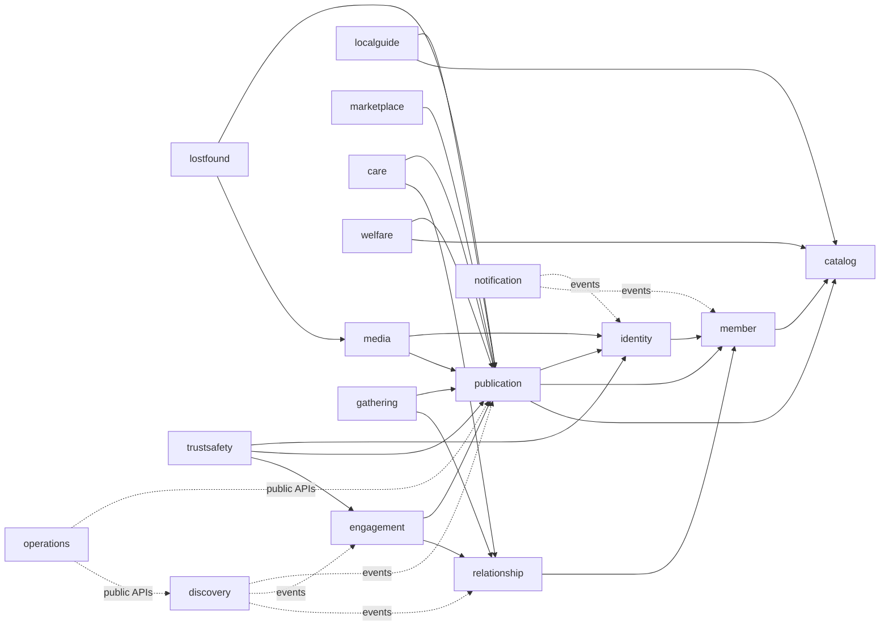

# TownPet application module map

이 문서는 [`ADR-0011`](../../ADR.md#adr-0011---17개-bounded-context를-기본-application-module로-정의한다)의 17개 bounded context를 Java package와 Spring Modulith가 실제로 검증하는 기준으로 고정한다. 현재는 한 개의 배포 단위지만, 의존성과 write ownership은 독립 모듈로 취급한다.

## 경계 규칙

- 모듈 root의 `package-info.java`가 display name과 경계를 선언한다.
- 다른 모듈이 사용할 수 있는 타입은 향후 `<module>.api` named interface에만 둔다.
- JPA entity, repository, infrastructure adapter, web DTO는 모듈 내부 구현이다.
- `common`은 UUID·clock·오류·관측성 같은 기술 공통 요소만 제공하며 business entity와 repository를 제공하지 않는다.
- Spring Modulith 검증은 순환 의존과 공개되지 않은 타입 참조를 실패시키고, ArchUnit은 내부 계층의 cross-module 참조를 차단한다.

## 코드 증거

| 증거 | 위치 |
|---|---|
| module declarations | `src/main/java/com/townpet/*/package-info.java` |
| named interfaces | `src/main/java/com/townpet/*/api/package-info.java` |
| module detection/cycle test | `src/test/java/com/townpet/architecture/ModularityTest.java` |
| layer exposure rules | `src/test/java/com/townpet/architecture/LayerRulesTest.java` |
| executable verification | `./gradlew modulithTest` |
