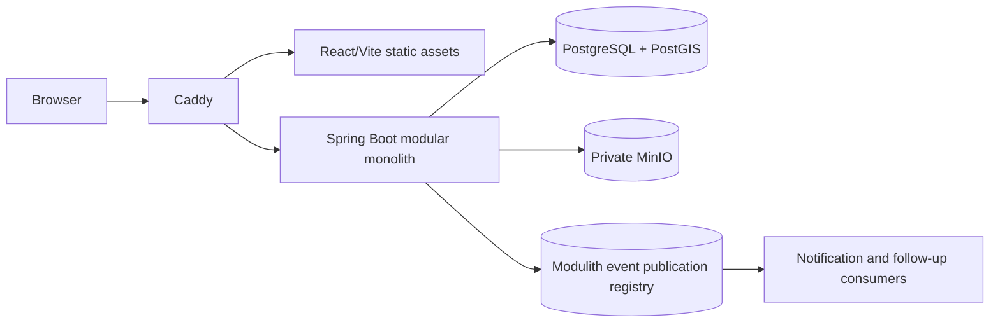
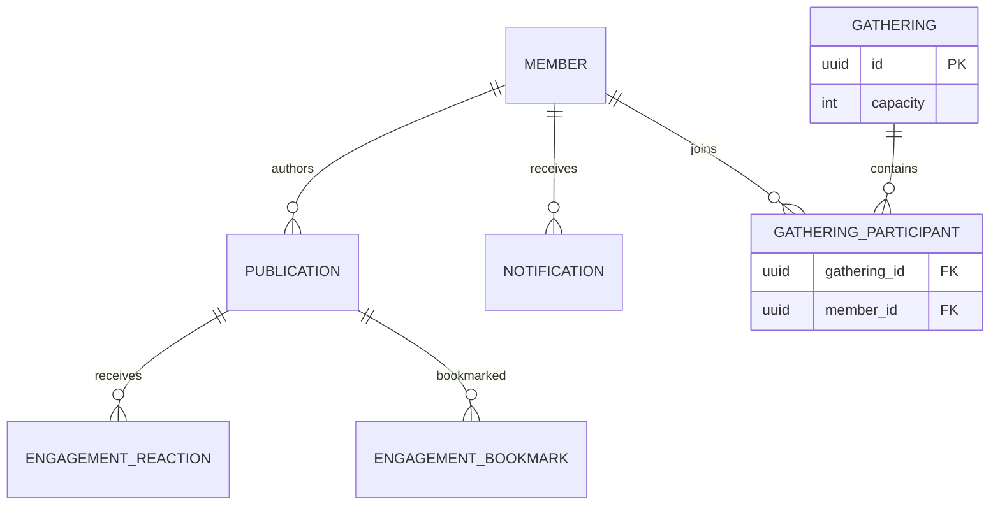

# TownPet architecture

## Runtime flow

운영 배포는 Caddy가 외부 진입점이고, web은 정적 asset을 제공하며, backend가 HTTP 계약과 business rule을 소유한다. PostgreSQL이 domain state와 event publication의 source of truth이고 MinIO에는 private media만 둔다.

## Module ownership

`identity`, `member`, `publication`, `engagement`, `discovery`, `notification`, `lostfound`, `marketplace`, `care`, `gathering`, `media`, `trustsafety`, `operations`는 각각 공개 application API와 내부 구현을 분리한다. module 사이에는 JPA entity·repository를 직접 노출하지 않고 식별자, 공개 application API 또는 event로 연결한다.

## Focused data relationships

모임 aggregate의 capacity는 부모 row lock으로 보호하고, `(gathering_id, member_id)` unique constraint는 동일 회원 중복을 막는다. 알림은 publication event id를 unique key로 사용해 재전달을 atomic하게 dedup한다.

## Evidence links

- 모듈·계층 경계: `src/test/java/com/townpet/architecture/ModularityTest.java`
- 피드 조회: `src/main/java/com/townpet/discovery/FeedController.java`, `portfolio/evidence/feed-performance.md`
- 모임 정합성: `src/main/java/com/townpet/gathering/GatheringService.java`, `portfolio/evidence/gathering-concurrency.md`
- 이벤트 후속 처리: `src/main/java/com/townpet/notification/NotificationEventHandler.java`, `portfolio/evidence/notification-delivery.md`
- 배포·복구: `deploy/deploy-netcup.sh`, `deploy/backup-portfolio.sh`, `portfolio/evidence/backup-restore.md`
